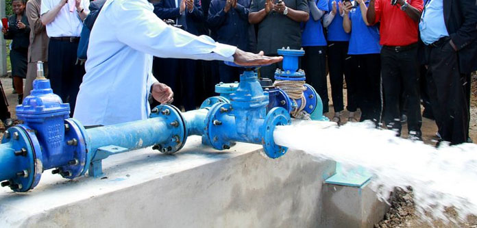
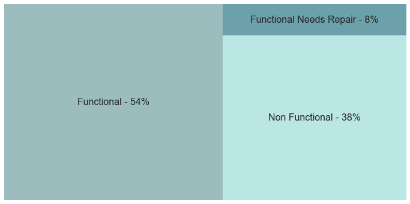

# Module 3 Final Project - Predicting the Condition of Waterpoints in Tanzania

## Business Case

Did you know 2.2 billion people globally do not have safely managed drinking water services?

Water is an essential of life, yet millions around the world still don’t have access to clean water. 
One of the most common causes of death in the developing world is drinking dirty and diseased water.


Tanzania has a water and sanitation crisis. Only 60% of the population of 61 million have access to
an improved source of safe water (protected from contamination), and 34% of the population has access to improved sanitation. 
The demand for both water and sanitation is high.

Water wells provide clean water for years. In rural areas, they are a lifeline for the inhabitants as
this may be the only source of potable water.

Since 2007, the government of Tanzania has been implementing a Water Sector Development Programme at a cost of around $300 billion USD.

Non-functioning waterpoints force communities to rely on unsafe sources of water, often several kilometres away, affecting not just health but education too.



### Brief

Using data from Taarifa and the Tanzanian Ministry of Water, can you predict which pumps are functional, 
which need some repairs, and which don't work at all? This is an intermediate-level practice competition. 
Predict one of these three classes based on a number of variables about what kind of pump is operating, 
when it was installed, and how it is managed. A smart understanding of which waterpoints will fail can improve 
maintenance operations and ensure that clean, potable water is available to communities across Tanzania.

The goal is to predict the operating condition of a waterpoint for each record in the dataset.

This is also an [active competition](https://www.drivendata.org/competitions/7/pump-it-up-data-mining-the-water-table/page/23/) and classifier results can be submitted and compared against the work of over 11,000 other competitors.

## Repository Overview
```
index.ipynb             
# Jupyter notebook containing code for data discovery, EDA and a number of models, 
with improving accuracy, that aim to predict the condition of the waterpoints.

presentation.pdf        
# A non-technical presentation of the project findings.

regional_choropleth.html
# Choropleth map highlighting regional variations in the percentage of functional
waterpoints throughout Tanzania.

└── source-data 

    ├── training-set-values.csv                 
        # Raw "training" dataset of 59,400 Tanzanian waterpoints.

    ├── training-set-labels.csv
        # Raw "training" labels, denoting the functional status of the Tanzania 
        waterpoints, corresponding to the waterpoint data provided in
        training-set-values.csv.   

    ├── test-set-values.csv                 
        # Raw "test" dataset of 'unseen' Tanzanian waterpoints to be used to predict
        their functional status.   

└── submission-data 
          
        # Data files containing the predicted status of the waterpoints in the correct
        submission format for the competition.

└── other-data

        tanzania-regions.geojson
        # GeoJSON file containing shape data for the administrative regions within Tanzania
        for use in the choropleth.

└── images


```

## Approach

As outlined in the [Jupyter Notebook](index.ipynb) included in this repository, the approach constituted four main parts:

1. The **[Business Case and Project Purpose](index.pynb#business-case)**.

2. Initial **[Exploratory Data Analysis](index.pynb#eda)** to review and validate the data fields available in both the `training-set-values.csv` and `training-set-labels.csv` datasets, understand each feature, the quality of the data and their relationships both with each other and with the target variable, `status_group`.  The notebook contains several visualisations that are used in the [non-technical presentation](presentation.pdf) but also a choropleth map showing regional variations throughout Tanzania of the percentage of functional waterpoints.  Unfortunately the map does not appear inline within the notebook but in a [separate file](regional_choropleth.html).



3. The creation, refinement through iteration, validation and evaluation of **[Ternary Classifier Models](index.pynb#modelling)** that predict the functional status of the waterpoints contained within the `test-set-values.csv` dataset.

4. The creation of a **[Submission Function](index.pynb#competition-submission-file)** that preprocesses the `test-set-values.csv` waterpoint data and that outputs a submission file for the competition based on the supplied classifier model. 


## Conclusions

The [Jupyter Notebook](index.ipynb#modelling) contains the details of each classifier using different machine learning techniques to improve the overall accuracy of predicted values.

It was potentially unnecessary to use quite so many different machine learning techniques to create the predictive classifer. It was nonetheless interesting to observe and compare the different accuracy scores obtain against the overall efficiency / time taken to execute each classifier.

In a many instances, the data fields provided are either direct duplicates of other fields or provide the same information as other fields but in greater detail.

By dropping the more detailed data fields, converting key data such as construction year into appropriate categorical variables and through an iterative, but not exhaustive, process of elimination, we have arrived at a list of the following features that achieve an optimal accuracy score for the classifier.


## Requisite Python Libraries

The following python libraries have been used as part of this project:

* [Pandas](https://pandas.pydata.org/)
* [NumPy](https://numpy.org/)
* [Seaborn](https://seaborn.pydata.org/)
* [Matplotlib](https://matplotlib.org/)
* [Squarify](https://github.com/laserson/squarify) (`pip install squarify` to install)
* [Folium](https://python-visualization.github.io/folium/)
* [JSON](https://docs.python.org/3/library/json.html)
* [scikit-learn](https://scikit-learn.org/)
* [statsmodels](https://www.statsmodels.org/stable/index.html)
* [SciPy](https://www.scipy.org/)
* [XGBoost](https://xgboost.readthedocs.io/en/latest/)